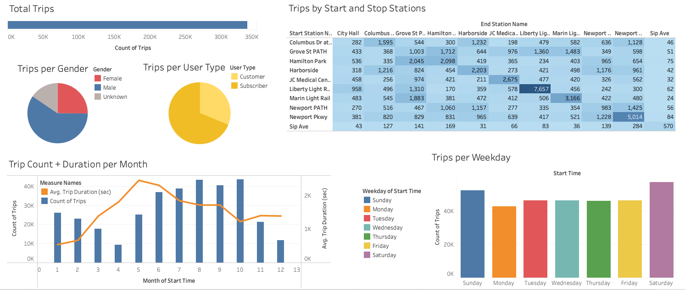
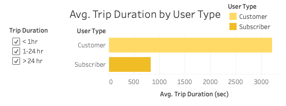
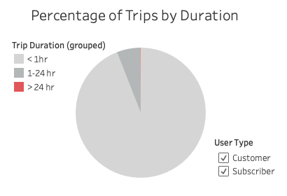
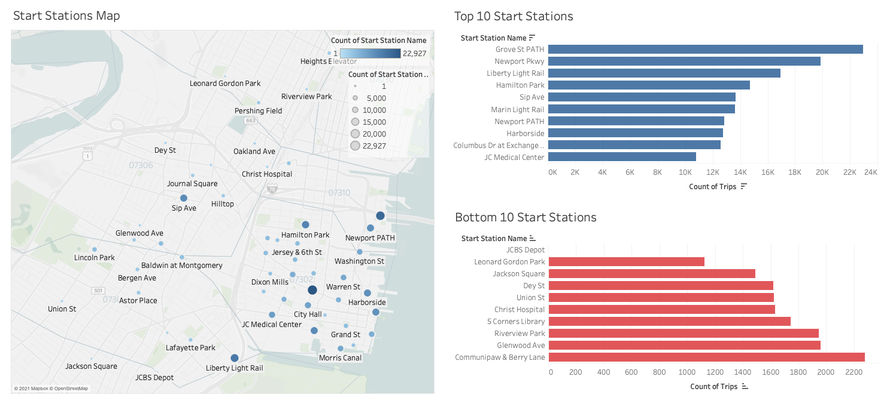
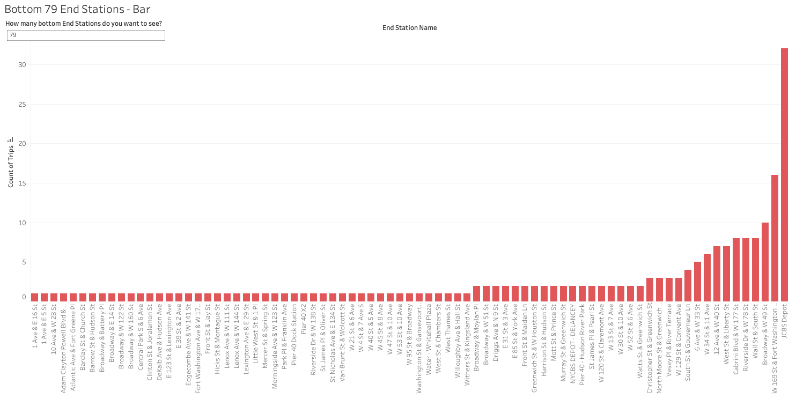

# Citi Bike Analytics
This project uses a combination of Python and Tableau to generate reports for CitiBike data in the year 2020.

[Click Here to Download Full Tableau File](https://github.com/brbbrb/Tableau-CitiBike-Analytics/raw/main/CitiBike_Jersey_City_2020.twbx)

## Background

CitiBike Program is the largest bike sharing program in the United States. Since 2013, the Citi Bike Program has implemented a robust infrastructure for collecting data on the program's utilization. Through the team's efforts, each month bike data is collected, organized, and made public on the [Citi Bike Data](https://www.citibikenyc.com/system-data) webpage.

## Python: Data Aggregation and Cleaning

Due to the limited nature of Tableau Public and the large amount of data, I made the decision to only work with Jersey City data from 2020 (62.4 MB). The process went as such:
* downloaded each Jersey City 2020 CSV file from the [Citi Bike Data](https://www.citibikenyc.com/system-data) webpage
* combined, converted (to pandas DataFrame), and exported all 12 CSV files with 8 lines of code (credit to [Free Code Camp](https://www.freecodecamp.org/news/how-to-combine-multiple-csv-files-with-8-lines-of-code-265183e0854/))
* removed anomalies (such as coordinates far outside the reach of a CitiBike or riders who claimed to be over 100 years old)
* saved and exported changes to CSV file (59 MB)

## Tableau: Data Visualization and Analytics 

After exploring the data and creating many visualizations in the Worksheets, 6 Dashboards were designed, then combined to create a Story. The whole Tableau file can be [downloaded here](https://github.com/brbbrb/Tableau-CitiBike-Analytics/raw/main/CitiBike_Jersey_City_2020.twbx), or you can just view the Tableau Story directly on [Tableau Public](https://public.tableau.com/views/CitiBike_Jersey_City_2020/CitiBikeJerseyCity2020?:language=en-US&:display_count=n&:origin=viz_share_link) (no download required). See below for a non-interactive version of the Tableau Story.

## Trips Overview
There was CitiBike data available from 2013 till September 2021, but I wanted to focus on 2020, as that was a very pivotal year in New York. I also decided to only use Jersey City data due to the limitations of Tableau Public. There were 336,780 trips recorded in 2020. If broken down by Gender, Males took almost 60% of all trips, with Females trailing at 25% and Unknown at 15%. The Start and End Station chart highlights the most common routes, which based on the current filters (only stations with 10,000 trips as Start and End Stations) the roundtrip to and from Liberty Light Rail seems to be the most popular. According to the chart, people generally return the CitiBikes to the same location they started, as indicated by the dark diagonal line. Based on the bar/line graph, April and December had the lowest number of trips, while April through July had the longest average trip length. Of all weekdays, the weekend had the most trips, with all other days about equal.

## Trip Duration - Pt. I
Below are two graphs depicting the number of trips taken within each 5 minute increment. Most trips were less than an hour, but there were also trips lasting 37 days, so neither graph can really show the extremely long rides. The next Dashboard solves this by breaking up the rides up into 3 categories: < 1 hr, 1-24hr, and >24hr.

## Trip Duration - Pt. II
Not only does breaking up the trips into 3 distinct categories (< 1 hr, 1-24hr, and >24hr) display better than the previous charts, but if broken down by User Type, they tell a greater story. Take note of the great difference in trip duration between User Types: 53 minutes, 37 seconds for Subscribers and 13 minutes, 47 seconds for Customers. The predicted reason for this phenomenon is that Customers who have paid for 24-hr or 3-day passes are more aware of their purchase and are trying to make the most of it, versus the annual Subscribers who probably "set it and forget it". 

The pie chart displays how many trips fell into each category: 94% < 1 hr, 5.9% 1-24hr, and .1% > 24hr. The little red sliver representing trips over 24hr is barely distinguishable, but plays a big role in raising the Average Trip Duration for Customers, since most of the trips over 24hr were from that User Type. Another possible explanation for the disparity between Trip Duration of the User Types is that Subscribers are more likely to be daily commuters versus Customers who may be tourists and/or others trying to explore the city for multiple days.

On the full version of the Tableau file, you can:
1) Deselect any of the 3 Trip Duration categories to see how they affect the overall Average Trip Duration by User Type. 
2) Deselect User Types to see how they affect the pie chart and 3x Trip Duration bar charts.

## Start Stations
The most popular Start Station is Grove St PATH, with nearly 23,000 trips in 2020 alone. It is uniquely situated by downtown Jersey City and a major bridge to New York, which is likely why it recieves so much traffic. Other top Start Stations are in close proximity to subway stations, parks, and other noteable points of interest. The least popular Start Station was JCBS Depot with only 1 ride for all of 2020. More thorough research would need to be done in order to find out why only 1 ride started here. Other less popular Start Stations tend to be in less popular areas, away from noteable points of interest.

## End Stations - Pt. I
Like Start Stations, Grove St PATH was the #1 End Station, presumably due to its prime location. 

As for the bottom stations, 46 only had 1 ride end at those locations, so a bottom 10 chart would be of little help. Instead, there is a dynamic bubble chart where you can type the number of bottom stations you'd like to see. On the full Tableau file, you can try entering these numbers or experiment with your own:

  (a) 46: all the End Stations with 1 trip  
  (b) 79 and 80: to see how unpopular the bottom 79 End Stations are  
  (c) 130: all End Stations. 
 

Many of the End Stations with less than 100 trips were across the bridge in New York, a trek most riders would not take.

## End Stations - Pt. II
This chart displays a more traditional view of the bottom N Number of End Stations, also based on the number you type. Again, those suggestions are: (a) 46  (b) 79 and 80  (c) 130, but feel free to try out your own too!

## Interactive Tableau File
Check out the full interactive Tableau file on [Tableau Public](https://public.tableau.com/views/CitiBike_Jersey_City_2020/CitiBikeJerseyCity2020?:language=en-US&:display_count=n&:origin=viz_share_link).
